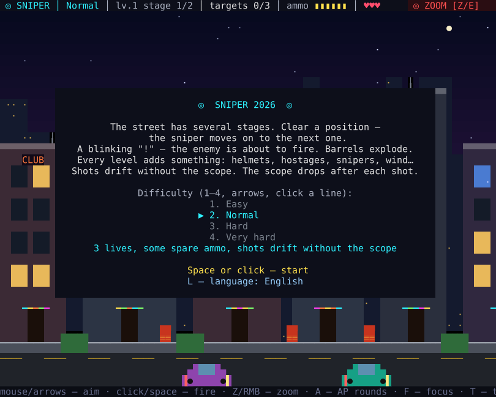

# ◎ SNIPER 2026

**English** | [Русский](README.ru.md)

A sniper game on a neon street — a mod for [Claude Code](https://claude.com/claude-code). It opens in a panel right in your terminal, so you can take a few shots while Claude is thinking.

Enemies pop out of windows, doors, from behind cars and barricades. The street has several stages: clear a position and the sniper moves on to the next one. Every level adds something new. The game speaks English and Russian — press `L` to switch.




| Scope | Thermal in a blackout |
|---|---|
|  |  |

| Sunset | Snow |
|---|---|
|  |  |

## Install

You need Claude Code with mod (hook plugin) support and a terminal of at least 50×16 characters.

Inside Claude Code, run:

```
/plugin marketplace add rav3n/claude_mode_sniper
/plugin install sniper@claude-mode-sniper
/reload-plugins
```

Then type `/sniper` and click the panel to give it the keyboard. `Esc` closes the game.

<details>
<summary><strong>Prefer the terminal?</strong></summary>

```bash
claude plugin marketplace add rav3n/claude_mode_sniper
claude plugin install sniper@claude-mode-sniper
```

Then run `/reload-plugins` and `/sniper` inside a session.

</details>

<details>
<summary><strong>Update and uninstall</strong></summary>

```bash
claude plugin marketplace update claude-mode-sniper
claude plugin update sniper@claude-mode-sniper
claude plugin uninstall sniper@claude-mode-sniper
```

After an update, run `/reload-plugins` in an open session.

</details>

<details>
<summary><strong>For development: from a folder</strong></summary>

```bash
git clone git@github.com:rav3n/claude_mode_sniper.git ~/claude_mode_sniper
claude --plugin-dir ~/claude_mode_sniper
```

Claude Code watches a `--plugin-dir` folder, so edits reload the mod on their own. To load it without the flag, add this to `~/.claude/settings.json`:

```json
{
  "env": {
    "CLAUDE_CODE_PLUGIN_DIRS": "~/claude_mode_sniper"
  }
}
```

</details>

## Controls

| Action | Keys |
|---|---|
| Aim | mouse, arrows or `WASD` (`Shift` — faster) |
| Fire | click, `Space`, `F`, `Enter` |
| 2× scope | `Z`, `E`, `Q`, `Tab`, right mouse button or the "◎ ZOOM" button in the corner |
| Focus (slow motion) | `C` — from level 2, charged by kills |
| Thermal | `T` — from level 3, the battery drains and recharges |
| Pause / restart | `P` / `R` |
| Language (English / Русский) | `L` |
| Music / sound | `B` / `V` |
| Difficulty | `1`–`4` in the menu, `M` after a fight |
| Continue a saved game | `C` in the menu; after a loss — retry the stage |

Keys also work on a Russian keyboard layout.

## How to play

- Unscoped shots drift; a settled scope is exact. After each shot the bolt cycles and the scope drops.
- A blinking `!` and a flashing gun mean the enemy is about to fire.
- Misses and an empty magazine lead to failure: ammo is handed out per stage.
- Red barrels explode in a chain and take nearby enemies with them.
- Quick kills in a row give DOUBLE KILL, TRIPLE KILL and RAMPAGE.
- The last enemy of a stage triggers slow motion.
- Progress saves itself at the start of every stage and after each completed level. Close the panel or Claude Code — next time the menu offers "C — continue" with your level, stage and score.

### What each level unlocks

| Level | Theme | New |
|---|---|---|
| 1 | neon night | windows, doors, roofs, cars, barricades, barrels |
| 2 | dusk | helmeted enemies — the first head shot knocks the helmet off · focus |
| 3 | night | hostages in windows — don't shoot them · thermal |
| 4 | sunset | rooftop snipers give themselves away with a glint · supply drones with ammo and medkits |
| 5 | rain | wind pushes the bullet; the scope shows where it will land |
| 6 | blackout | almost dark — thermal saves the day |
| 7 | snow | half the enemies wear helmets |

After that the themes cycle and the enemies get faster.

### Difficulty

| | Lives | Ammo | Notes |
|---|---|---|---|
| Easy | 5 | plenty | slow enemies |
| Normal | 3 | some spare | shots drift without the scope |
| Hard | 2 | +1 per stage | the scope sways |
| Very hard | 1 | exactly one per target | a miss means failure, use the scope |

### Easter eggs

The city hides a few secrets. Hints: look closely at the neon signs and windows, at whoever sits on the roofs, and at the sky. There is also a code from the eighties.

## Development

```
.claude-plugin/plugin.json       plugin manifest
.claude-plugin/marketplace.json  marketplace: install via /plugin
hooks/register.tsx               /sniper command, panel, sounds, best score, save, language
hooks/game.tsx                   the game: logic, drawing, texts in English and Russian
sounds/                          sound effects (WAV)
tests/                           tests
```

Tests:

```bash
claude plugin test .
claude plugin validate .
```

A game frame is a tree of coloured text spans, and the mod engine limits its size. That is why the graphics are made of characters with large solid fills: this way the field fills the whole panel. On very large panels it is capped at about 4400 cells and centred.
