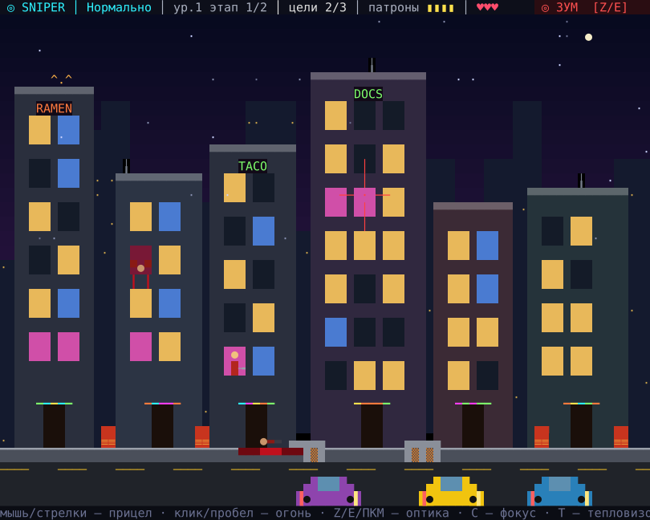
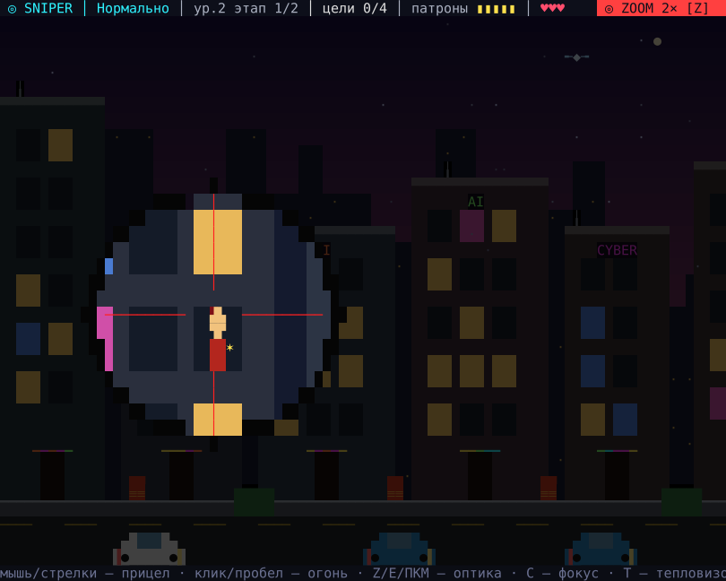
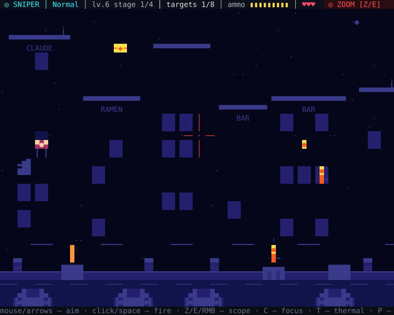
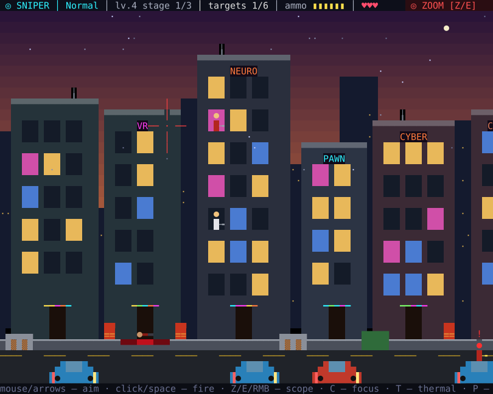
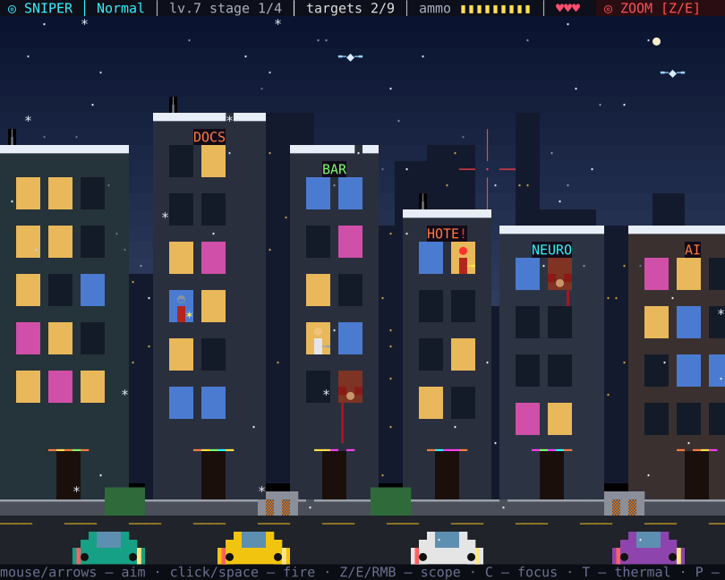

# ◎ SNIPER 2026

Снайпер на неоновой улице — мод для [Claude Code](https://claude.com/claude-code). Игра открывается в панели прямо в терминале: можно пострелять, пока Claude думает над задачей.

Враги лезут из окон, дверей, из-за машин и баррикад. Улица состоит из нескольких этапов: зачистил позицию — снайпер сам перебегает к следующей. С каждым уровнем появляется что-то новое.



| Оптика | Тепловизор в блэкаут |
|---|---|
|  |  |

| Закат | Снег |
|---|---|
|  |  |

## Установка

Нужен Claude Code с поддержкой модов (плагинов с хуками) и терминал хотя бы 50×16 символов.

1. Склонируй репозиторий:

   ```bash
   git clone git@github.com:rav3n/claude_mode_sniper.git ~/claude_mode_sniper
   ```

2. Запусти Claude Code с модом:

   ```bash
   claude --plugin-dir ~/claude_mode_sniper
   ```

3. В сессии набери `/sniper` и кликни по панели, чтобы она получила клавиатуру. `Esc` закрывает игру.

Чтобы мод загружался всегда, без флага, добавь путь в `~/.claude/settings.json`:

```json
{
  "env": {
    "CLAUDE_CODE_PLUGIN_DIRS": "~/claude_mode_sniper"
  }
}
```

Обновление — `git pull` в папке мода. Если Claude Code открыт, мод перезагрузится сам.

## Управление

| Действие | Клавиши |
|---|---|
| Прицел | мышь, стрелки или `WASD` (`Shift` — быстрее) |
| Огонь | клик, `Пробел`, `F`, `Enter` |
| Оптика 2× | `Z`, `E`, `Q`, `Tab`, правая кнопка мыши или кнопка «◎ ЗУМ» в углу |
| Фокус (замедление) | `C` — со 2-го уровня, копится за убийства |
| Тепловизор | `T` — с 3-го уровня, батарея садится и заряжается |
| Пауза / заново | `P` / `R` |
| Музыка / звук | `B` / `V` |
| Сложность | `1`–`4` в меню, `M` после боя |
| Продолжить сохранённую игру | `C` в меню, после провала — с начала этапа |

## Как играть

- Без оптики пуля гуляет, в устоявшемся прицеле летит точно. После выстрела затвор передёргивается, и оптика слетает.
- Мигающий `!` и вспыхнувший ствол — враг сейчас выстрелит.
- Промахи и пустой магазин — путь к провалу: патроны выдаются на каждый этап.
- Красные бочки взрываются цепочкой и сносят врагов рядом.
- Быстрые убийства подряд дают DOUBLE KILL, TRIPLE KILL и RAMPAGE.
- На последнем враге этапа включается слоумо.
- Прогресс сохраняется сам: в начале каждого этапа и после пройденного уровня. Закрыл панель или Claude Code — в следующий раз в меню будет «C — продолжить» с уровнем, этапом и счётом.

### Что открывается по уровням

| Уровень | Тема | Новое |
|---|---|---|
| 1 | неоновая ночь | окна, двери, крыши, машины, баррикады, бочки |
| 2 | сумерки | враги в касках — первая пуля в голову сбивает каску · фокус |
| 3 | ночь | заложники в окнах — в них стрелять нельзя · тепловизор |
| 4 | закат | снайперы на крышах выдают себя бликом · дроны снабжения с патронами и аптечками |
| 5 | дождь | ветер сносит пулю, в оптике видно, куда она ляжет |
| 6 | блэкаут | почти темно — выручает тепловизор |
| 7 | снег | половина врагов в касках |

Дальше темы идут по кругу, а враги становятся быстрее.

### Сложность

| | Жизни | Патроны | Особенности |
|---|---|---|---|
| Легко | 5 | с запасом | враги медленные |
| Нормально | 3 | небольшой запас | без оптики пуля гуляет |
| Сложно | 2 | +1 на этап | прицел качается |
| Очень сложно | 1 | ровно по целям | промах = провал, без оптики не попасть |

### Пасхалки

В городе спрятано несколько секретов. Подсказки: присмотрись к неоновым вывескам и окнам, к тому, кто сидит на крышах, и к небу. А ещё есть один код из восьмидесятых.

## Разработка

```
.claude-plugin/plugin.json   манифест
hooks/register.tsx           команда /sniper, панель, звуки, рекорд и сохранение
hooks/game.tsx               сама игра: логика и отрисовка
sounds/                      звуки (WAV)
tests/                       тесты
```

Тесты:

```bash
claude plugin test .
claude plugin validate .
```

Кадр игры — дерево цветных текстовых полосок, и у движка модов есть лимит на его размер. Поэтому графика символьная, с крупными однотонными заливками: так поле занимает всю панель. На очень больших панелях оно ограничено примерно 4400 клетками и стоит по центру.
